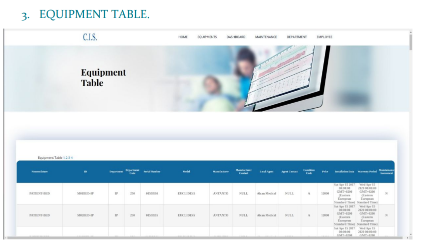
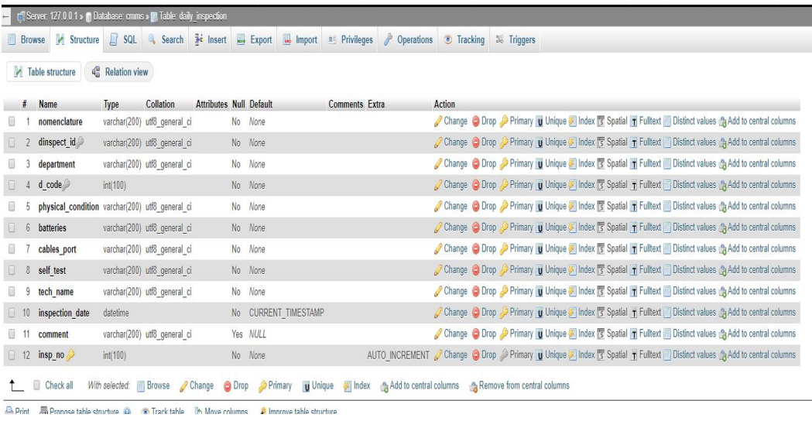

# Computrized Maintainance Management System

We developed a website launched by a server and connected to A sql database to host a simple comutarized maintainace management system that can be used into any medical facilities as hospitals or clinics.

For more details check CMMS.pdf uploaded to the repository

## **Team Members**

* Asmaa Mahmoud
* Salma Mohamed
* Mohammed Almotasem
* Marwa Abdullah
* Menna Hamdy

---

The website introduces many features as:

1. Add an equipment, employee and department.
2. Calibrate, PPM, scrap or report for a certain equipment.
3. Make a daily pass form.
4. Search for any added equipment form.

We implemented the FRONT END by using HTML, CSS and JavaScript; DATABASE by using MYSQL and; BACKEND by using NODEJS.

